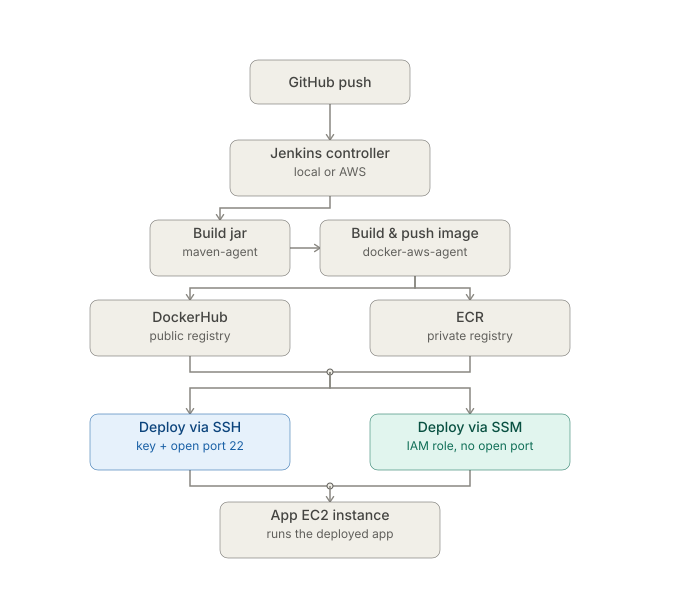
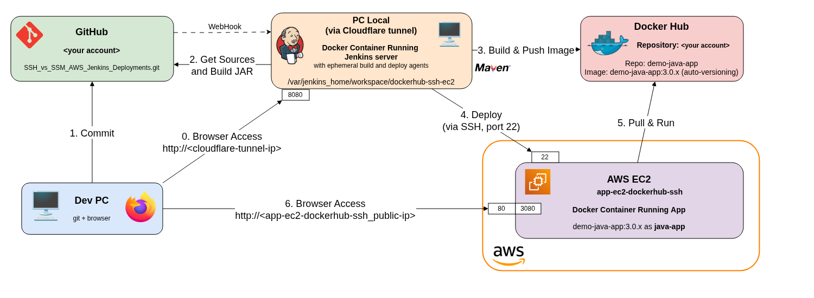
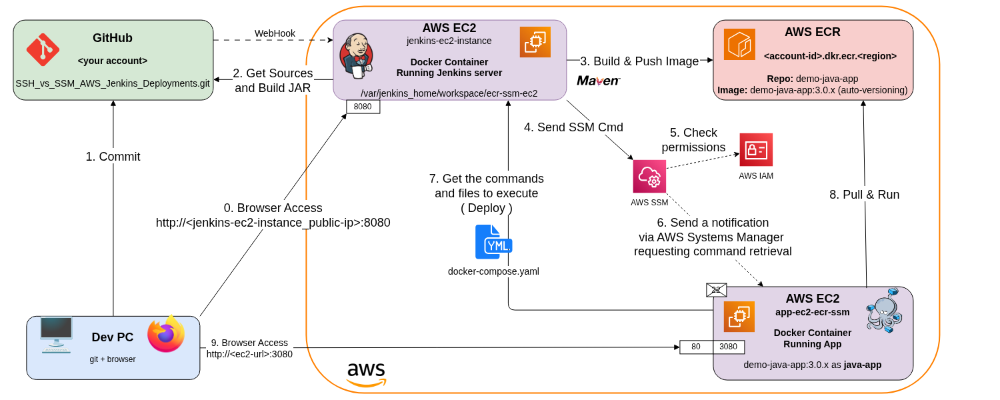

# Jenkins CI/CD — Docker + JCasC + AWS
 
**Same pipeline, four deployment strategies.** 

Comparison of **DockerHub** vs **a private registry (ECR)**, and **SSH** vs **SSM**, on a self-configured **Jenkins platform (Docker Compose + Configuration as Code)** that can be run **locally** or **on AWS**.
 
## Why this project
 
Should a production EC2 instance maintain an open SSH port and a key pair that must be protected indefinitely, or should it authenticate exclusively via an IAM role and SSM, without any open ports or keys?

This repository implements the **CI/CD pipeline for a single Java application using four variations [ DockerHub|ECR × SSH|SSM ]**, enabling the application to be run using different approaches and compared objectively.




## Engineering decisions
 
- **One shared Jenkins library** — build/push/deploy/cleanup logic written once per registry/transport pair, never duplicated.
- **JCasC hot-reload** — switching the active combo is a config reload, not an image rebuild.
- **Least privilege for app instances** — each app instance's role and security group are scoped to exactly what its combo needs. However, the Jenkins role or credentials cover all combinations from the start to facilitate switching between them, since the choice is made later, during the execution of `test_deployments.sh` (see "What each combo uses" below).
- **One persistent instance per combo** — created once, reused idempotently; no IP or credentials modifications.

  ### Why 4 instances, and not only 1 ?

    The first attempt used a single app instance, that I destroyed and recreated on every combo switch, to minimize AWS costs. 

    In practice this meant to regenerate SSH keys, IAM roles, IP addresses, and credentials each time which needed to be resynced, turning a simple "test of another combo" into a complex reset that also needed to let port 22 activated to be sure to reaccess it even if the instance did not use it.

    Splitting into 4 persistent instances, each with a stable IP and its own combo-scoped role, removes that complexity entirely and — as a side effect — makes the four approaches easier to compare directly, since each instance behaves exactly as its combo dictates. 

    Therefore, they share two security groups (one with and another without SSH access), accorded to the decided transport protocol, port 22 is thus only open when necessary.

  >| Combo | What the instance needs |
  >|---|---|
  >| dockerhub + ssh | SSH key, port 22 |
  >| dockerhub + ssm | IAM role: SSM |
  >| ecr + ssh | SSH key + IAM role: ECR |
  >| ecr + ssm | IAM roles: ECR + SSM |


## Prerequisites

### 1. Fork or clone this repo

Needed to get your own GitHub webhook. Fork:
```bash
gh repo fork https://github.com/DevCTx/SSH_vs_SSM_AWS_Jenkins_Deployments --clone
```
Or clone, drop the history, and push to your own repo:
```bash
git clone https://github.com/DevCTx/SSH_vs_SSM_AWS_Jenkins_Deployments
cd SSH_vs_SSM_AWS_Jenkins_Deployments

rm -rf .git && git init && git add . && git commit -m "Initial commit" && git branch -M main

gh repo create <your-account>/SSH_vs_SSM_AWS_Jenkins_Deployments --public \
  --description "Full CI/CD pipeline for a Java application: triggered by a GitHub webhook on push, built with Maven on Jenkins, automatic image tagging, push to DockerHub or AWS ECR, and deployment to AWS EC2 via SSH or SSM." \
  --source=. --push
```

### 2. GitHub token
 
*Settings > Developer settings > Personal access tokens > Fine-grained tokens > Generate new token*

- **Token name**: `jenkins-token` 
- **Description**: `Jenkins Token for SSH_vs_SSM_AWS_Jenkins_Deployments repository` 
- **Resource owner**: `<your GitHub account>` 
- **Expiration**: `7 days` or more if needed 
- **Repository Access**: Select **only** the `SSH_vs_SSM_AWS_Jenkins_Deployments` repository 
- **Repository permissions** (everything else on *No access*) :
 
>| Permission | Level | Why |
>|---|---|---|
>| Contents | Read-only | clone / checkout the sources |
>| Metadata | Read-only | required by default (auto) |
>| Commit statuses | Read and write | post the CI status on commits |
>| Webhooks | Read and write | Manage the hooks for a repository |
 
**Copy the token** and **save to** `.env`:
```
GITHUB_JENKINS_TOKEN=<github_pat_xxx>
GITHUB_OWNER=<your GitHub account>
REPO=<your account>/SSH_vs_SSM_AWS_Jenkins_Deployments
```
Test: `chmod 744 ./test_github_config.sh && ./test_github_config.sh` — expect
`✅ GITHUB_JENKINS_TOKEN matches GITHUB_OWNER` and `✅ REPO '...' is accessible`.
 
### 3. DockerHub token (only needed for DockerHub combos)
 
> *Account Settings > Personal Access Tokens > New access token*

- **Access Token Description**: `jenkins-myapp` 
- **Expiration Date**: `30 days` 
- **Access Permissions**: `Read, Write & Delete` 
 
**Copy the token** and **save to** `.env`:
```
DOCKER_USERNAME=<your Docker Hub account>
DOCKERHUB_PAT=<dckr_pat_xxx>
```
Test: `chmod 744 ./test_dockerhub_config.sh && ./test_dockerhub_config.sh` — expect `Login Succeeded`.
 
### 4. AWS CLI
 
Install the CLI, then configure it with an IAM admin user's access key
(needs rights to create roles/instances/IAM users — this account is only
used from your machine, never stored in `.env`):
https://docs.aws.amazon.com/fr_fr/cli/latest/userguide/getting-started-install.html

**Get your AWS credentials**
> *IAM > Users > Your Admin User > Security credentials > Access keys > Create access key*
- select **Command Line Interface (CLI)**
- **Description** : `jenkins-ci`
- **Copy** the credentials or **Download the .csv** out of the repo 
Click **Done**

**Configure the CLI**
```bash
aws configure   # access key, secret key, region, output format
```
Test: `aws sts get-caller-identity` — expect a JSON block with your `UserId`, `Account`, and `Arn`.


## Quick start

1. **Install Jenkins** :
   - **Locally**: 
      `jenkins_install/jenkins_local_install.sh`
         - Installs Docker if missing, 
         - builds the 3 agents, 
         - starts the controller with a neutral default config, 
         - opens a Cloudflare tunnel, 
         - and sets the GitHub webhook.
   - **On AWS**: 
      `jenkins_install/jenkins_aws_install.sh`
         - Creates the Jenkins EC2 instance first if it doesn't exist yet, 
         - transfers the repo to it, 
         - then runs the same install remotely.

2. **If both are installed, pick which one is active**:
      `./switch_jenkins.sh <local|aws>`

3. **Pick the desired configuration** :
    - **Registry**: DockerHub or AWS ECR?
    - **Transport**: SSH or SSM protocol?

   - Then run the test for a combo: 
      `./test_deployments.sh <dockerhub|ecr> <ssh|ssm>`
         - Creates that combo's app EC2 instance if needed, 
         - creates the local IAM user if that combo needs AWS credentials and Jenkins is local, 
         - writes and loads the matching JCasC config, 
         - triggers the pipeline, 
         - and verifies the deployed tag on EC2.

4. **Repeat for each combo you want to test.**

**All the scripts apply exactly the IAM/SSH/SSM permissions needed for the chosen combo, no more, no less (least-privilege principle).**


## Exemple : Testing deployment of the the Java App to AWS EC2 instance via Jenkins on local and a registry on dockerhub, using SSH protocol (port 22 opened)

```bash
./jenkins_install/jenkins_local_install.sh
./test_deployments.sh dockerhub ssh
```




## Exemple : Testing deployment of the the Java App to AWS EC2 instance via Jenkins on AWS and a registry on AWS ECR, using SSM protocol (No port 22 opened)

```bash
./jenkins_install/jenkins_aws_install.sh
./test_deployments.sh ecr ssm
```




## What each combo uses

The **transport** (SSH/SSM) drives the deployment mechanism and security group; 

The **registry** (DockerHub/ECR) only drives build/push credentials and whether ECR IAM roles are needed. 

The two axes are independent.

| | **dockerhub+ssh** | **dockerhub+ssm** | **ecr+ssh** | **ecr+ssm** |
|---|---|---|---|---|
| Jenkinsfile | `dockerhub_ssh_ec2` | `dockerhub_ssm_ec2` | `ecr_ssh_ec2` | `ecr_ssm_ec2` |
| Build/push credential — Jenkins **local** | `dockerhub-username` + `dockerhub-pat` | `dockerhub-username` + `dockerhub-pat` | `aws-creds` → `ecr get-login-password` | `aws-creds` → `ecr get-login-password` |
| Build/push credential — Jenkins on **AWS** | `dockerhub-username` + `dockerhub-pat` | `dockerhub-username` + `dockerhub-pat` | `jenkins-ec2-role` → `ecr get-login-password` | `jenkins-ec2-role` → `ecr get-login-password` |
| Deploy credential — Jenkins **local** | `app-ec2-ssh-key` | `aws-creds` → `ssm send-command` | `app-ec2-ssh-key` | `aws-creds` → `ssm send-command` |
| Deploy credential — Jenkins on **AWS** | `app-ec2-ssh-key` | `jenkins-ec2-role` → `ssm send-command` | `app-ec2-ssh-key` | `jenkins-ec2-role` → `ssm send-command` |
| IAM — app instance | *none* | `AmazonSSMManagedInstanceCore` | `AmazonEC2ContainerRegistryReadOnly` | both |
| IAM — Jenkins **local** user (`jenkins-local-aws-creds`, bound to credential `aws-creds`) | *none* | `AmazonSSMFullAccess` | `AmazonEC2ContainerRegistryFullAccess` | both |
| IAM — Jenkins on **AWS** (`jenkins-ec2-role`, shared by every combo — policies accumulate, never removed) | *none* | `AmazonSSMFullAccess` | `AmazonEC2ContainerRegistryFullAccess` | both |
| App security group | `app-ec2-ssh-sg` (port 22 open) | `app-ec2-ssm-sg` (never port 22) | `app-ec2-ssh-sg` (port 22 open) | `app-ec2-ssm-sg` (never port 22) |
| Deployment mechanism | `docker run` over SSH | `docker compose up` via SSM | `docker run` over SSH | `docker compose up` via SSM |
| AWS API call from Jenkins | none | `ssm send-command` | `ecr get-login-password` / `batch-delete-image` | both |

The `aws ...` calls are the same either way; only the credentials differ.

With Jenkins local, `aws-creds` uses environment variables created for this purpose (`AWS_ACCESS_KEY_ID`, `AWS_SECRET_ACCESS_KEY`). 

With Jenkins on AWS, these variables aren't needed — the AWS CLI queries the instance directly, internally, which provides temporary access (renewed roughly
every 6 hours, never stored) generated from the IAM role.


## Uninstall

Every `*_install.sh` has a matching `*_uninstall.sh`, undoing exactly what its counterpart created — never more. 

Shared resources (an SSH key or security group reused by another combo, an ECR repo shared by both ECR combos) are left alone by default, since removing them could break a sibling combo still in use.

```bash
./aws_ec2_install/aws_ec2_app_uninstall.sh <dockerhub|ecr> <ssh|ssm>   # terminate that combo's app instance
./jenkins_install/jenkins_local_uninstall.sh                           # tear down the local Jenkins stack
./jenkins_install/jenkins_aws_uninstall.sh                             # tear down Jenkins on AWS AND terminate its instance
```

Or tear down everything at once, with a separate confirmation for the DockerHub/ECR registries themselves:
```bash
./uninstall_all.sh
```

## Repo structure

```
SSH_vs_SSM_AWS_Jenkins_Deployments/
├── aws_ec2_install/      # EC2 install scripts: one instance per combo + optional Jenkins-on-AWS instance
│   ├── aws_ec2_app_install.sh       # creates/reuses app-ec2-<registry>-<transport>
│   ├── aws_ec2_app_uninstall.sh     # terminates one combo's app instance
│   ├── aws_ec2_jenkins_install.sh   # creates/reuses the Jenkins-on-AWS instance
│   ├── aws_ec2_jenkins_uninstall.sh # terminates the Jenkins-on-AWS instance
│   └── aws_shared_library.sh        # AMI lookup, security groups, IAM roles/profiles, ...
├── cloudflare/           # script to create a tunne for a public IP address when Jenkins is local
├── docs/
│   └── architecture.svg            # diagram used in this README
├── env_install/          # shared helpers (.env, public IP, IMDS)
├── java_app/             # the demo Spring Boot app built and deployed by every combo
│   ├── pom.xml
│   └── src/main/
│       ├── java/com/example/Application.java
│       └── resources/
│           ├── application.properties      # server.port=3080, matches APP_CONTAINER_PORT
│           └── static/index.html
├── jenkins_install/      # Jenkins install scripts on local or on AWS + webhook setup
│   ├── jenkins_local_install.sh
│   ├── jenkins_local_uninstall.sh
│   ├── jenkins_aws_install.sh
│   ├── jenkins_aws_uninstall.sh
│   ├── setup_github_webhook.sh
│   ├── controller/                 # jenkins controller Dockerfile + active jenkins-config.yaml
│   └── agents/                     # base / maven / docker-aws agent Dockerfiles
├── jenkins_configs/      # jenkins-config.yaml variants for desired configuration (see table)
│   ├── default.yaml      # neutral config loaded by *_install.sh (auth on, no combo job)
│   └── reload_jenkins_config.sh
├── pipelines/            # Jenkinsfile + Dockerfile per combo (registry_transport_ec2/)
│   ├── dockerhub_ssh_ec2/
│   ├── dockerhub_ssm_ec2/
│   ├── ecr_ssh_ec2/
│   └── ecr_ssm_ec2/
├── test_github_config.sh
├── test_dockerhub_config.sh
├── test_deployments.sh   # test per combo
├── switch_jenkins.sh     # pick which installed Jenkins (local/AWS) is active
└── uninstall_all.sh      # tears down everything, with confirmations
```

## Credits

If you reuse this repo or part of it, please keep this attribution:

"originally built by [DevCTx](https://github.com/DevCTx) —
[SSH_vs_SSM_AWS_Jenkins_Deployments](https://github.com/DevCTx/SSH_vs_SSM_AWS_Jenkins_Deployments)."

Thanks for reading.